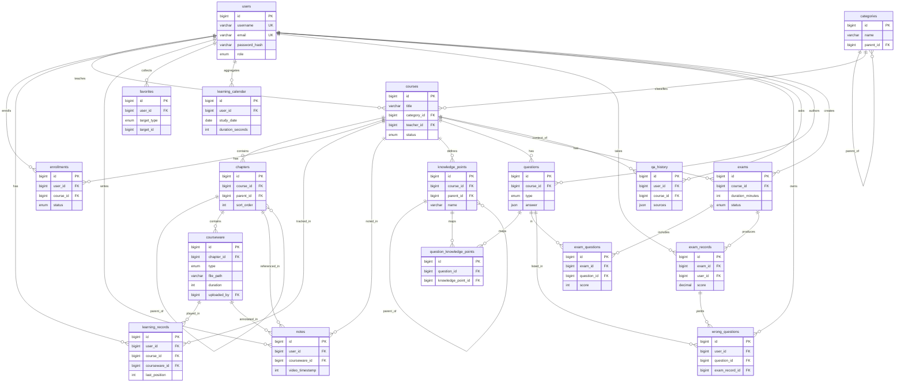

# 数据库设计与 ER 关系

- 数据库：**MySQL 8.0**（业务数据，`utf8mb4` / `utf8mb4_unicode_ci`）、**Redis 7.0**（会话缓存/限流/临时数据）、**ChromaDB**（课程知识向量，持久化）。
- 命名规范：**表名小写复数**；**字段下划线分隔**；**主键 `id` 自增（BIGINT UNSIGNED）**；**外键 `{表单数}_id`**。
- 时间字段统一 `created_at` / `updated_at`（`DATETIME`，默认当前时间 / 更新时刷新）。
- 建表方式：改 SQLAlchemy 模型 → `alembic revision --autogenerate` → 人工检查 → `alembic upgrade head`。**禁止手改表结构**（详见 `CLAUDE.md` 第 6 节）。

> 本文档在需求确认书基础上**补全**了：`categories`、`enrollments`、`favorites`、`learning_calendar`、`knowledge_points`、`question_knowledge_points`、`exam_questions`，并为 `courseware` 补充了上传相关字段、为 `courses` 增加分类外键。

---

## 1. 表清单总览

| 表 | 说明 | 归属模块 |
|----|------|----------|
| `users` | 用户认证与角色 | 认证 |
| `categories` | 课程分类（补全） | 课程 |
| `courses` | 课程 | 课程 |
| `chapters` | 章节（树形，自关联） | 课程 |
| `courseware` | 课件（视频/PDF/PPT，补全上传字段） | 课程 |
| `enrollments` | 选课关系（补全） | 学习 |
| `learning_records` | 学习进度/播放断点 | 学习 |
| `notes` | 笔记（关联视频时间点） | 学习 |
| `favorites` | 收藏（补全，多态） | 学习 |
| `learning_calendar` | 学习日历/日聚合（补全） | 学习/分析 |
| `knowledge_points` | 知识点（补全，可树形） | 题库/答疑 |
| `questions` | 题库 | 考试 |
| `question_knowledge_points` | 题目↔知识点映射（补全，多对多） | 考试 |
| `exams` | 考试 | 考试 |
| `exam_questions` | 考试↔题目关联（补全，多对多 + 分值/序号） | 考试 |
| `exam_records` | 考试记录/成绩 | 考试 |
| `wrong_questions` | 错题本 | 考试 |
| `qa_history` | 智能问答记录 | 答疑 |

---

## 2. 字段明细

### 2.1 users — 用户
| 字段 | 类型 | 约束 | 说明 |
|------|------|------|------|
| id | BIGINT UNSIGNED | PK, AI | |
| username | VARCHAR(64) | UNIQUE, NOT NULL | 登录名 |
| email | VARCHAR(128) | UNIQUE, NOT NULL | |
| password_hash | VARCHAR(255) | NOT NULL | bcrypt |
| role | ENUM('admin','teacher','student') | NOT NULL, DEFAULT 'student' | 角色 |
| nickname | VARCHAR(64) | NULL | |
| avatar_url | VARCHAR(512) | NULL | |
| is_active | TINYINT(1) | NOT NULL, DEFAULT 1 | |
| created_at / updated_at | DATETIME | | |

**索引**：UNIQUE(`username`)、UNIQUE(`email`)、INDEX(`role`)。

### 2.2 categories — 课程分类（补全）
| 字段 | 类型 | 约束 | 说明 |
|------|------|------|------|
| id | BIGINT UNSIGNED | PK, AI | |
| name | VARCHAR(64) | NOT NULL | 分类名 |
| parent_id | BIGINT UNSIGNED | FK→categories.id, NULL | 支持二级分类，自关联 |
| sort_order | INT | DEFAULT 0 | 排序 |
| created_at / updated_at | DATETIME | | |

**索引**：INDEX(`parent_id`)、UNIQUE(`parent_id`,`name`)。

### 2.3 courses — 课程
| 字段 | 类型 | 约束 | 说明 |
|------|------|------|------|
| id | BIGINT UNSIGNED | PK, AI | |
| title | VARCHAR(200) | NOT NULL | |
| description | TEXT | NULL | |
| cover_url | VARCHAR(512) | NULL | 封面 |
| category_id | BIGINT UNSIGNED | FK→categories.id, NULL | **分类（补全）** |
| teacher_id | BIGINT UNSIGNED | FK→users.id, NOT NULL | 授课教师 |
| status | ENUM('draft','published','offline') | NOT NULL, DEFAULT 'draft' | 上架/下架 |
| price | DECIMAL(10,2) | DEFAULT 0.00 | 预留 |
| student_count | INT UNSIGNED | DEFAULT 0 | 选课人数冗余（可缓存） |
| created_at / updated_at | DATETIME | | |

**索引**：INDEX(`teacher_id`)、INDEX(`category_id`)、INDEX(`status`)、可选 FULLTEXT(`title`,`description`)。

### 2.4 chapters — 章节（树形，自关联）
| 字段 | 类型 | 约束 | 说明 |
|------|------|------|------|
| id | BIGINT UNSIGNED | PK, AI | |
| course_id | BIGINT UNSIGNED | FK→courses.id, NOT NULL | |
| parent_id | BIGINT UNSIGNED | FK→chapters.id, NULL | 树形结构 |
| title | VARCHAR(200) | NOT NULL | |
| sort_order | INT | DEFAULT 0 | 同级排序 |
| created_at / updated_at | DATETIME | | |

**索引**：INDEX(`course_id`)、INDEX(`parent_id`)。

### 2.5 courseware — 课件（补全上传字段）
| 字段 | 类型 | 约束 | 说明 |
|------|------|------|------|
| id | BIGINT UNSIGNED | PK, AI | |
| chapter_id | BIGINT UNSIGNED | FK→chapters.id, NOT NULL | 所属章节 |
| title | VARCHAR(200) | NOT NULL | |
| type | ENUM('video','pdf','ppt','doc') | NOT NULL | 课件类型 |
| file_path | VARCHAR(512) | NOT NULL | 存储路径（UPLOAD_DIR 下） |
| file_name | VARCHAR(255) | NULL | 原始文件名（补全） |
| file_size | BIGINT UNSIGNED | NULL | 字节数（补全） |
| mime_type | VARCHAR(128) | NULL | MIME（补全） |
| duration | INT UNSIGNED | NULL | 视频时长(秒)，video 专用（补全） |
| sort_order | INT | DEFAULT 0 | |
| uploaded_by | BIGINT UNSIGNED | FK→users.id, NULL | 上传者（补全） |
| created_at / updated_at | DATETIME | | |

**索引**：INDEX(`chapter_id`)、INDEX(`type`)。
**备注**：MVP 视频用 HTTP Range 直出 `file_path`，不做 HLS（见决策 3）。

### 2.6 enrollments — 选课关系（补全）
| 字段 | 类型 | 约束 | 说明 |
|------|------|------|------|
| id | BIGINT UNSIGNED | PK, AI | |
| user_id | BIGINT UNSIGNED | FK→users.id, NOT NULL | 学生 |
| course_id | BIGINT UNSIGNED | FK→courses.id, NOT NULL | |
| status | ENUM('active','completed','dropped') | DEFAULT 'active' | |
| progress_percent | DECIMAL(5,2) | DEFAULT 0.00 | 课程整体进度冗余 |
| enrolled_at | DATETIME | NOT NULL | 选课时间 |
| created_at / updated_at | DATETIME | | |

**索引**：**UNIQUE(`user_id`,`course_id`)**（防重复选课）、INDEX(`course_id`)。

### 2.7 learning_records — 学习进度
| 字段 | 类型 | 约束 | 说明 |
|------|------|------|------|
| id | BIGINT UNSIGNED | PK, AI | |
| user_id | BIGINT UNSIGNED | FK→users.id, NOT NULL | |
| course_id | BIGINT UNSIGNED | FK→courses.id, NOT NULL | |
| courseware_id | BIGINT UNSIGNED | FK→courseware.id, NOT NULL | 具体课件 |
| last_position | INT UNSIGNED | DEFAULT 0 | 视频断点(秒) |
| progress_percent | DECIMAL(5,2) | DEFAULT 0.00 | 该课件进度 |
| duration_watched | INT UNSIGNED | DEFAULT 0 | 累计观看时长(秒) |
| is_completed | TINYINT(1) | DEFAULT 0 | |
| last_learned_at | DATETIME | NULL | 最近学习时间 |
| created_at / updated_at | DATETIME | | |

**索引**：**UNIQUE(`user_id`,`courseware_id`)**、INDEX(`user_id`,`course_id`)。

### 2.8 notes — 笔记
| 字段 | 类型 | 约束 | 说明 |
|------|------|------|------|
| id | BIGINT UNSIGNED | PK, AI | |
| user_id | BIGINT UNSIGNED | FK→users.id, NOT NULL | |
| course_id | BIGINT UNSIGNED | FK→courses.id, NOT NULL | |
| chapter_id | BIGINT UNSIGNED | FK→chapters.id, NULL | |
| courseware_id | BIGINT UNSIGNED | FK→courseware.id, NULL | 关联课件 |
| content | TEXT | NOT NULL | 笔记内容 |
| video_timestamp | INT UNSIGNED | NULL | 关联视频时间点(秒) |
| created_at / updated_at | DATETIME | | |

**索引**：INDEX(`user_id`)、INDEX(`courseware_id`)。

### 2.9 favorites — 收藏（补全，多态）
| 字段 | 类型 | 约束 | 说明 |
|------|------|------|------|
| id | BIGINT UNSIGNED | PK, AI | |
| user_id | BIGINT UNSIGNED | FK→users.id, NOT NULL | |
| target_type | ENUM('course','courseware','note') | NOT NULL | 收藏对象类型 |
| target_id | BIGINT UNSIGNED | NOT NULL | 对象 id（逻辑外键，随 type 变） |
| created_at | DATETIME | | |

**索引**：**UNIQUE(`user_id`,`target_type`,`target_id`)**、INDEX(`target_type`,`target_id`)。
**备注**：多态收藏不建物理外键（`target_id` 指向不同表），应用层保证一致性。

### 2.10 learning_calendar — 学习日历（补全）
| 字段 | 类型 | 约束 | 说明 |
|------|------|------|------|
| id | BIGINT UNSIGNED | PK, AI | |
| user_id | BIGINT UNSIGNED | FK→users.id, NOT NULL | |
| study_date | DATE | NOT NULL | 学习日期 |
| duration_seconds | INT UNSIGNED | DEFAULT 0 | 当日学习总时长 |
| courseware_count | INT UNSIGNED | DEFAULT 0 | 当日学习课件数 |
| note_count | INT UNSIGNED | DEFAULT 0 | 当日笔记数 |
| created_at / updated_at | DATETIME | | |

**索引**：**UNIQUE(`user_id`,`study_date`)**、INDEX(`study_date`)。
**备注**：作为学习日历/热力图数据源，由学习行为按日聚合写入（`BackgroundTasks` 或落库时增量更新）。

### 2.11 knowledge_points — 知识点（补全）
| 字段 | 类型 | 约束 | 说明 |
|------|------|------|------|
| id | BIGINT UNSIGNED | PK, AI | |
| course_id | BIGINT UNSIGNED | FK→courses.id, NOT NULL | 所属课程 |
| parent_id | BIGINT UNSIGNED | FK→knowledge_points.id, NULL | 可树形 |
| name | VARCHAR(128) | NOT NULL | 知识点名称 |
| description | TEXT | NULL | |
| created_at / updated_at | DATETIME | | |

**索引**：INDEX(`course_id`)、INDEX(`parent_id`)。
**备注**：用于「知识点掌握度」「知识点诊断」；与题目多对多关联。

### 2.12 questions — 题库
| 字段 | 类型 | 约束 | 说明 |
|------|------|------|------|
| id | BIGINT UNSIGNED | PK, AI | |
| course_id | BIGINT UNSIGNED | FK→courses.id, NOT NULL | |
| type | ENUM('single','multiple','judge','short_answer') | NOT NULL | 单选/多选/判断/简答 |
| stem | TEXT | NOT NULL | 题干 |
| options | JSON | NULL | 选项（客观题）`[{"key":"A","text":"..."}]` |
| answer | JSON | NOT NULL | 标准答案（客观题为 key 数组；简答为参考文本） |
| analysis | TEXT | NULL | 解析（举一反三/错题解析用） |
| difficulty | TINYINT | DEFAULT 3 | 难度 1-5 |
| score | INT | DEFAULT 5 | 默认分值 |
| created_by | BIGINT UNSIGNED | FK→users.id, NULL | 出题教师 |
| created_at / updated_at | DATETIME | | |

**索引**：INDEX(`course_id`)、INDEX(`type`)。

### 2.13 question_knowledge_points — 题目↔知识点（补全，多对多）
| 字段 | 类型 | 约束 | 说明 |
|------|------|------|------|
| id | BIGINT UNSIGNED | PK, AI | |
| question_id | BIGINT UNSIGNED | FK→questions.id, NOT NULL | |
| knowledge_point_id | BIGINT UNSIGNED | FK→knowledge_points.id, NOT NULL | |

**索引**：**UNIQUE(`question_id`,`knowledge_point_id`)**、INDEX(`knowledge_point_id`)。

### 2.14 exams — 考试
| 字段 | 类型 | 约束 | 说明 |
|------|------|------|------|
| id | BIGINT UNSIGNED | PK, AI | |
| course_id | BIGINT UNSIGNED | FK→courses.id, NOT NULL | |
| title | VARCHAR(200) | NOT NULL | |
| description | TEXT | NULL | |
| duration_minutes | INT UNSIGNED | NOT NULL | 限时(分钟) |
| total_score | INT UNSIGNED | DEFAULT 100 | 总分 |
| pass_score | INT UNSIGNED | DEFAULT 60 | 及格分 |
| start_time | DATETIME | NULL | 开考窗口 |
| end_time | DATETIME | NULL | 截止窗口 |
| status | ENUM('draft','published','closed') | DEFAULT 'draft' | |
| created_by | BIGINT UNSIGNED | FK→users.id, NOT NULL | |
| created_at / updated_at | DATETIME | | |

**索引**：INDEX(`course_id`)、INDEX(`status`)。

### 2.15 exam_questions — 考试↔题目（补全，多对多）
| 字段 | 类型 | 约束 | 说明 |
|------|------|------|------|
| id | BIGINT UNSIGNED | PK, AI | |
| exam_id | BIGINT UNSIGNED | FK→exams.id, NOT NULL | |
| question_id | BIGINT UNSIGNED | FK→questions.id, NOT NULL | |
| score | INT | NOT NULL | 该题在本卷分值（覆盖题库默认分） |
| sort_order | INT | DEFAULT 0 | 题目在卷中顺序 |

**索引**：**UNIQUE(`exam_id`,`question_id`)**、INDEX(`question_id`)。

### 2.16 exam_records — 考试记录/成绩
| 字段 | 类型 | 约束 | 说明 |
|------|------|------|------|
| id | BIGINT UNSIGNED | PK, AI | |
| exam_id | BIGINT UNSIGNED | FK→exams.id, NOT NULL | |
| user_id | BIGINT UNSIGNED | FK→users.id, NOT NULL | 考生 |
| answers | JSON | NULL | 作答明细 `{"question_id": answer}` |
| score | DECIMAL(6,2) | NULL | 得分（客观题自动阅卷） |
| status | ENUM('in_progress','submitted','graded') | DEFAULT 'in_progress' | |
| started_at | DATETIME | NULL | 开始时间（防作弊计时） |
| submitted_at | DATETIME | NULL | 交卷时间 |
| created_at / updated_at | DATETIME | | |

**索引**：INDEX(`exam_id`,`user_id`)、INDEX(`user_id`)。

### 2.17 wrong_questions — 错题本
| 字段 | 类型 | 约束 | 说明 |
|------|------|------|------|
| id | BIGINT UNSIGNED | PK, AI | |
| user_id | BIGINT UNSIGNED | FK→users.id, NOT NULL | |
| question_id | BIGINT UNSIGNED | FK→questions.id, NOT NULL | |
| exam_record_id | BIGINT UNSIGNED | FK→exam_records.id, NULL | 来源考试记录 |
| wrong_answer | JSON | NULL | 学生错误作答 |
| wrong_count | INT UNSIGNED | DEFAULT 1 | 累计错误次数 |
| is_mastered | TINYINT(1) | DEFAULT 0 | 是否已掌握 |
| last_wrong_at | DATETIME | NULL | 最近错误时间 |
| created_at / updated_at | DATETIME | | |

**索引**：**UNIQUE(`user_id`,`question_id`)**、INDEX(`user_id`)。

### 2.18 qa_history — 智能问答记录
| 字段 | 类型 | 约束 | 说明 |
|------|------|------|------|
| id | BIGINT UNSIGNED | PK, AI | |
| user_id | BIGINT UNSIGNED | FK→users.id, NOT NULL | |
| course_id | BIGINT UNSIGNED | FK→courses.id, NULL | 问答上下文课程 |
| question | TEXT | NOT NULL | 用户提问 |
| answer | MEDIUMTEXT | NULL | LLM 回答 |
| sources | JSON | NULL | RAG 命中来源（chunk 引用） |
| created_at | DATETIME | | |

**索引**：INDEX(`user_id`)、INDEX(`course_id`)。
**备注**：向量检索走 ChromaDB（不在 MySQL），此表仅存问答明细与来源引用。

---

## 3. 整体 ER 图（Mermaid erDiagram）

---

## 4. 关系与设计说明

- **课程结构**：`categories(自关联) → courses → chapters(自关联树) → courseware`。
- **选课与学习**：`enrollments` 记录「谁选了哪门课」（唯一约束防重复）；`learning_records` 细到每个课件的断点/进度；`learning_calendar` 按日聚合供日历/热力图与学习时长统计。
- **收藏** `favorites` 采用多态（`target_type` + `target_id`），不建物理外键，应用层维护一致性。
- **知识点体系**：`knowledge_points`（可树形）↔ `questions` 通过 `question_knowledge_points` 多对多；支撑「知识点掌握度」「诊断」「班级排名」等分析。
- **考试组卷**：`exams` ↔ `questions` 通过 `exam_questions` 多对多，并在关联表上带**本卷分值/题序**；`exam_records` 存作答与自动阅卷得分；错题沉淀到 `wrong_questions`（`user_id`+`question_id` 唯一，累计错误次数）。
- **智能答疑**：向量存 ChromaDB；`qa_history` 仅存问答文本与 `sources` 引用。

## 5. 索引与性能建议

- 所有外键列建索引（MySQL InnoDB 外键需索引；即便应用层不加物理 FK 也建普通索引）。
- 高频查询组合索引：`learning_records(user_id, course_id)`、`exam_records(exam_id, user_id)`、`qa_history(user_id, created_at)`。
- 防重唯一约束：`enrollments(user_id,course_id)`、`learning_records(user_id,courseware_id)`、`favorites(user_id,target_type,target_id)`、`wrong_questions(user_id,question_id)`、`exam_questions(exam_id,question_id)`、`question_knowledge_points(question_id,knowledge_point_id)`。
- `courses` 标题搜索可加 FULLTEXT 或走应用层 LIKE + 缓存（课程列表 Redis TTL 5 分钟）。
- 冗余字段（`courses.student_count`、`enrollments.progress_percent`）用于降低聚合查询压力，写入时同步/异步维护。
